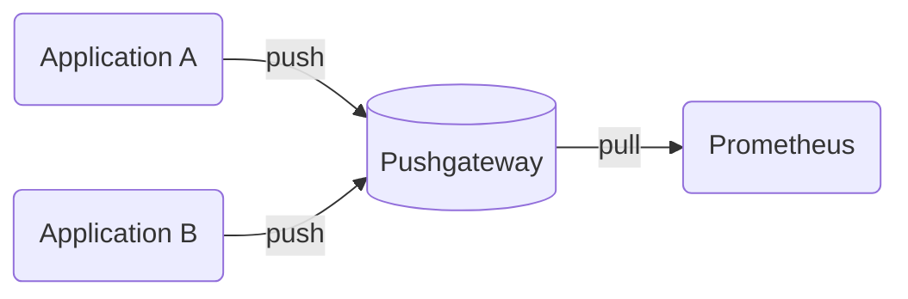

# Pushgateway -> Prometheus Tutorial

This is a tutorial on how to use the Pushgateway and go-application that push to them as you can see in the below diagram.

So basicly we have many applications that push metrics to the Pushgateway and Prometheus will grab them data from Pushgateway. This is a good way to expose metrics from many applications that are not able to expose metrics by themselves.

## Prerequisites
- Docker

## How to run
- Run `docker-compose up -d` to start the Pushgateway
- Run `go run cmd/main.go` to start the go-application that push metrics to the Pushgateway